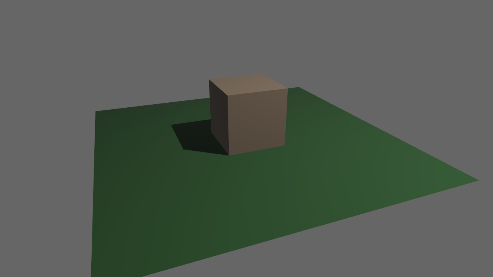

+++
title = "3d"
weight = 2
sort_by = "weight"
template = "book-section.html"
page_template = "book-section.html"
+++

This chapter will cover all things related to 3d rendering, from rendering basic shapes to making your own meshes.

Here is a complete example of a simple 3d scene. After this chapter you should be able to understand every part of this example.



```rust
use bevy::prelude::*;

fn main() {
    App::new()
        .add_plugins(DefaultPlugins)
        .add_startup_system(setup)
        .run();
}

/// set up a simple 3D scene
fn setup(
    mut commands: Commands,
    mut meshes: ResMut<Assets<Mesh>>,
    mut materials: ResMut<Assets<StandardMaterial>>,
) {
    // plane
    commands.spawn_bundle(PbrBundle {
        mesh: meshes.add(Mesh::from(shape::Plane { size: 5.0 })),
        material: materials.add(Color::rgb(0.3, 0.5, 0.3).into()),
        ..default()
    });
    // cube
    commands.spawn_bundle(PbrBundle {
        mesh: meshes.add(Mesh::from(shape::Cube { size: 1.0 })),
        material: materials.add(Color::rgb(0.8, 0.7, 0.6).into()),
        transform: Transform::from_xyz(0.0, 0.5, 0.0),
        ..default()
    });
    // light
    commands.spawn_bundle(PointLightBundle {
        point_light: PointLight {
            intensity: 1500.0,
            shadows_enabled: true,
            ..default()
        },
        transform: Transform::from_xyz(4.0, 8.0, 4.0),
        ..default()
    });
    // camera
    commands.spawn_bundle(PerspectiveCameraBundle {
        transform: Transform::from_xyz(-2.0, 2.5, 5.0).looking_at(Vec3::ZERO, Vec3::Y),
        ..default()
    });
}
```
