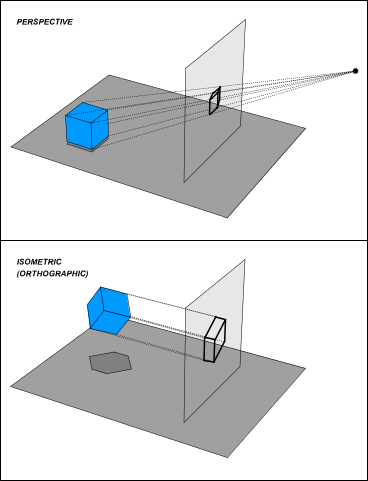

+++
title = "camera"
weight = 1
sort_by = "weight"
template = "book-section.html"
page_template = "book-section.html"
+++

<!-- Should this be in it's own section not nested under 3d or should the 2d section cover the Orthographic camera? -->

The first thing you will need if you want to render anything is a camera.

At it's core a camera is simply a 2d projection of the 3d scene. The most common type of projection used for 3d games is a perspective projection. Which is a projection that takes into account the distance between the camera and a vertex.

<!-- TODO we need a lighter background for this image -->
[](https://en.wikipedia.org/wiki/3D_projection#/media/File:Various_projections_of_cube_above_plane.svg)

In bevy just like most things in the engine a `Camera` is just a component. To simplify spawning a `Camera` with all the required components we can use a `PerspectiveCameraBundle`. This `Bundle` will spawn the camera and every other components required by bevy to render an image. If you prefer an orthographic projection you can use the `OrthographicCameraBundle`.

In the example at the beginning of the chapter we spawned a camera like this:

```rust
commands.spawn_bundle(PerspectiveCameraBundle {
    // This line spawns the camera at (-2.0, 2.5, 5.0) and rotates it
    // so that it looks at Vec3::ZERO, in other words it looks at the origin.
    transform: Transform::from_xyz(-2.0, 2.5, 5.0).looking_at(Vec3::ZERO, Vec3::Y),
    ..default()
});
```

## PerspectiveProjection

When spawning a `PerspectiveCameraBundle` it will spawn a `PerspectiveProjection` with default values.

```rust
struct PerspectiveProjection {
    // The field of view of the projection.
    pub fov: f32,
    // The aspect ratio, this is generally updated automatically based on the size of the window.
    pub aspect_ratio: f32,
    // The nearest part of the projection, anything that is in front of this plane will not be rendered by the camera.
    pub near: f32,
    // The farthest part of the projection, anything that is farther than this plane will not be rendered by the camera.
    pub far: f32,
}
```

## OrthographicProjection

You can also use an OrthographicProjection in 3d to give an isometric look to a 3d scene. This projection mode has multiple ScalingMode that can change the final look of the projection when zoomming in and out.

<!-- TODO this image needs to be scaled down a lot -->


```rust
struct OrthographicProjection {
    pub left: f32,
    pub right: f32,
    pub bottom: f32,
    pub top: f32,
    pub near: f32,
    pub far: f32,
    pub window_origin: WindowOrigin,
    pub scaling_mode: ScalingMode,
    pub scale: f32,
    pub depth_calculation: DepthCalculation,
}
```

## View Frustum and Frustum Culling

[](https://en.wikipedia.org/wiki/Viewing_frustum#/media/File:ViewFrustum.svg)

The area that is covered by the camera is what is generally called a view frustum. Anything that is inside that area will be rendered. By default bevy also tries to not render anything that is not inside this area, this is what is called frustum culling. All the settings on the Projection are essentially ways to control this view area.
